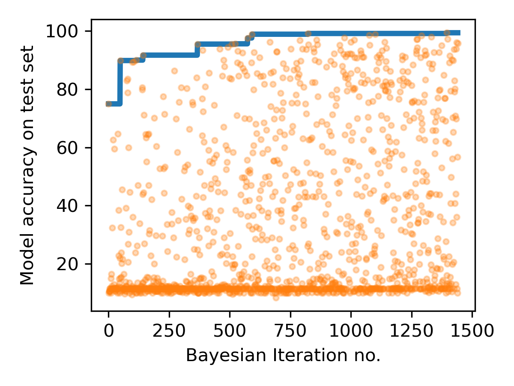

# CNN to classify electromagnetic modes in waveguides

A convolutional neural network is trained to classify the electromagnetic modes conducted by an optical waveguide, based on a picture of its cross-section. The model was trained on an analytically generated dataset with 10 000 pictures. The topology of the neural network was tuned through Bayesian optimisation, to maximise its performance after 2 training epochs. Performance accuracies measured iin excess of 99\% were found, as measured in an independent test dataset.

## DATA
The training and validation datasets were composed of 8-bit gray scale images of Hermite-Gaussian electromagnetic modes supported by optical waveguides, available in two resolutions 32x32 and 16x16. The training dataset has 10 000 pictures and the test dataset has 2000 pictures; For details, see [1 Generate dataset.ipynb](https://github.com/rfv2021/bayes_opt_cnn/blob/main/1%20Generate%20dataset.ipynb).

## MODEL 
Convolutional neural network with 2 convolutional layers and 3 fully connected layers. This architecture is based on the popular Le-Net5. The model topology was adapted through bayesian optimisation to maximise the accuracy after 2 training epochs. For details, see [2 Build model.ipynb](https://github.com/rfv2021/bayes_opt_cnn/blob/main/2%20Build%20model.ipynb).

## HYPERPARAMETER OPTIMSATION
The free parameters in the Bayesian optimisation were:

- The width of the convolution filters 1 and 2;
- The output depth of the convolution filter 1;
- The output depth of the convolution filter 2 ;
- Number of output features of fully connected layer 1;
- Number of output features of fully connected layer 2;
- The learning rate of the stochastic gradient descent optimiser;
- The momentum of the stochastic gradient descent optimiser.

The Bayesian optimisation was based in a Gaussian Process (GP) as surrogate function and used the expected improvement criterium on the acquisition function. For each new iteration, the GP was fit by maximisation of the log marginal likelihood. The results of the optimisation were progressively stored in a pandas Dataframe and stored as a pickle file. They are available under /optimisation_results/ and can be easily visualised with [3 Load optimisation results.ipynb](https://github.com/rfv2021/bayes_opt_cnn/blob/main/3%20Load%20optimisation%20results.ipynb).

## RESULTS
- The model performance was measured in terms of classification accuracy (acc) on an independent test set, containing 2 000 images. Several CNN configurations produce satisfying results. Around 30 configurations have acc > 95\%, after only 2 epochs of training. With 3 training epochs accuracies in excess of 99\% are found.

- The progression of the Bayesian optimisation is shown below:
 
- Training the CNN network with 2 epochs took an average of 1 minutes. This allowed to run a large number of optimisation iterations (1400) over 24hours. As suggested by the picture, a highly explorative strategy was used, as i was curious about the diversity of CNN topologies that could perform well.

- For more details, see [3 Load optimisation results.ipynb](https://github.com/rfv2021/bayes_opt_cnn/blob/main/3%20Load%20optimisation%20results.ipynb).

## CONTACT DETAILS
Rui Vasconcelos is the author of this model and can be contacted through his personal email (alhavaite.rui@gmail.com) or Linkedin page (www.linkedin.com/in/rui-f-vasconcelos);

